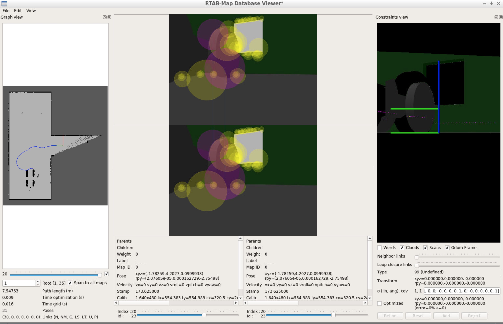

# Udacity Robotics Nanodegree
# Project #3: Where Am I?



## Introduction
This is a project for Udacity's Robotics NanoDegree. It's a robot that uses a Hokuyo laser scanner and Monte Carlo Localization to localize itself inside a simulated environment.

## Concepts and Classes
Concepts explored in this project:

  - Monte Carlo Localization
  - ROS AMCL package

## Getting Started
To view this project, you must have Gazebo and ROS installed on Linux.

[Click here for Gazebo download and installation instructions](http://gazebosim.org).

[Click here for ROS installation instructions](http://wiki.ros.org/ROS/Installation).

To begin, several ROS packages need to be installed as dependencies:

```
$ sudo apt-get update && sudo apt-get upgrade -y
$ sudo apt-get install ros-kinetic-navigation ros-kinetic-map-server ros-kinetic-move-base ros-kinetic-amcl libignition-math2-dev protobuf-compiler
```

With the dependencies installed, download/clone the repository, navigate up to the root level directory, and execute:
```
$ catkin_make
$ source devel/setup.bash
$ roslaunch my_robot world.launch
```

This will initialize all the nodes. In Rviz, you should see a red robot on a black and white map, surrounded by blue arrows representing the particles associated with the AMCL filter.

You can then command the robot to move in Rviz by pressing the "2D Nav Goal" button at the top, and clicking/dragging on the map. The robot will move the position you click, and the arrows will condense around the robot, indicating the filter's best guess as to the position of the robot (and the associated uncertainty).

To operate the robot via the keyboard, open a second terminal, navigate to the root level directory, and execute:
```
$ source devel/setup.bash
$ rosrun teleop_twist_keyboard teleop_twist_keyboard.py
```

You can then command the robot to move using the keys indicated by the teleop node.
